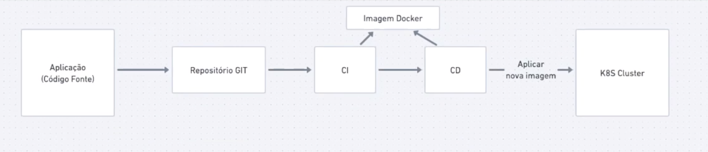
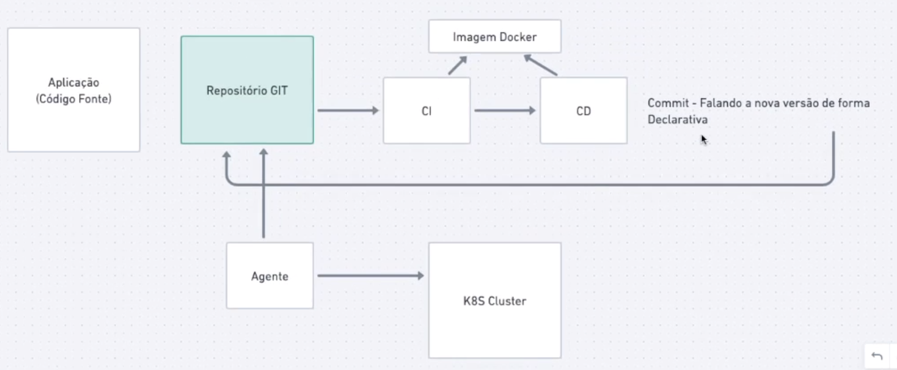
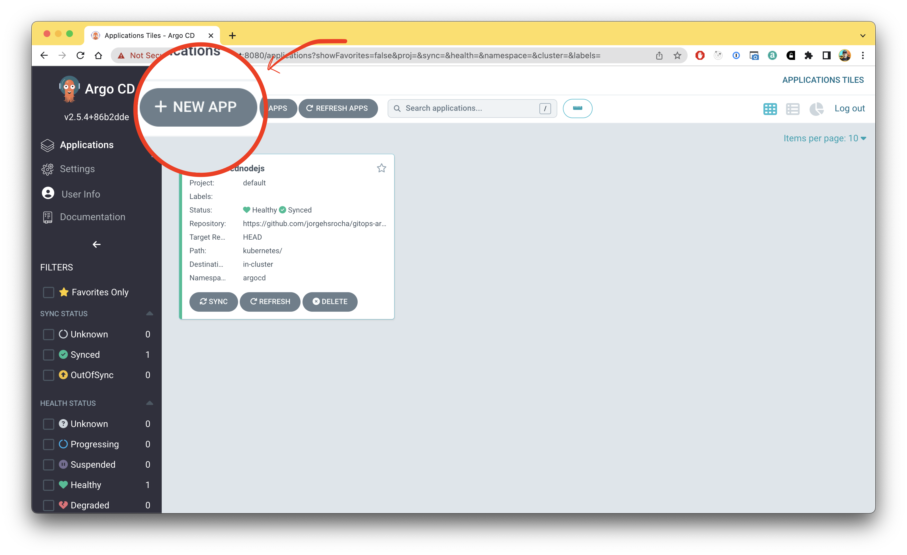
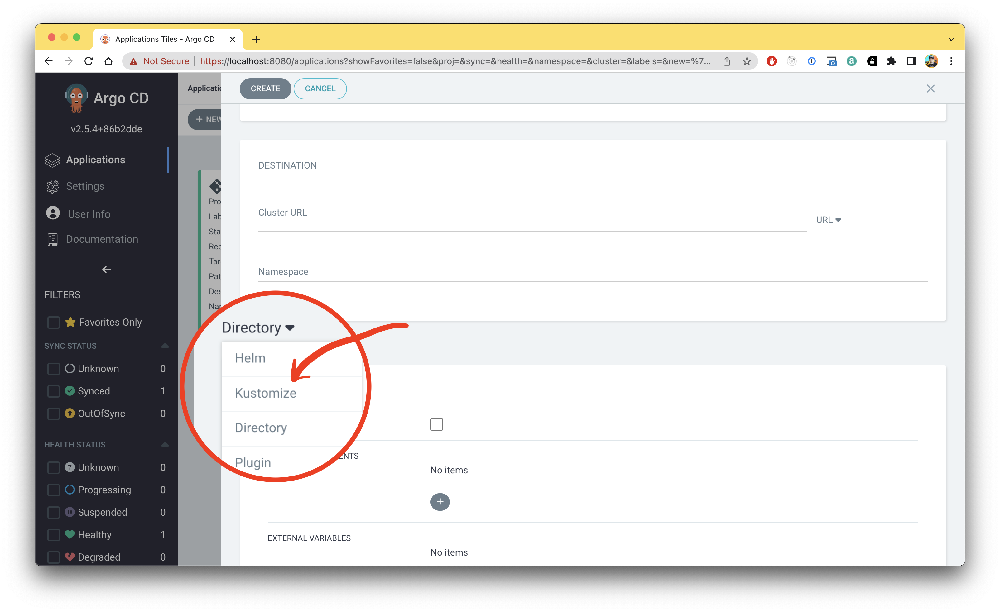
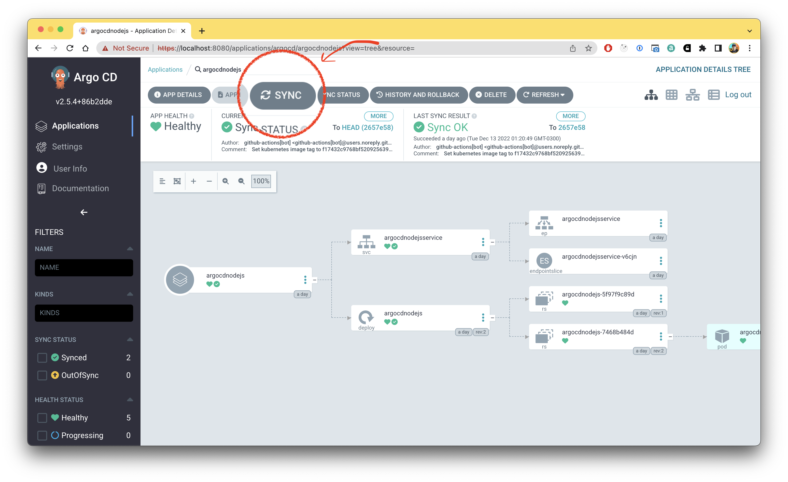

# 🔥 Um estudo sobre GitOps para engenheiros

## 1. O que é GitOps ?

Segundo a Atlassian: 

> *O GitOps é um padrão de fluxo de trabalho incrivelmente poderoso para gerenciar a infraestrutura de nuvem moderna. Embora o foco principal esteja no gerenciamento de clusters do Kubernetes, a comunidade de DevOps está aplicando e publicando soluções de GitOps em outros sistemas que não sejam de Kubernetes.*
> 

> *A ideia do GitOps foi criada e compartilhada pela Weaveworks, uma empresa de gerenciamento corporativo do Kubernetes e, desde então, proliferou em toda a comunidade de DevOps. GitOps é uma extensão da IaC e da configuração declarativa discutidas acima. O GitOps adiciona alguma mágica ao fluxo de trabalho de pull request que sincroniza o estado do sistema ativo com o do repositório de configuração estática. - Atlassian*
> 

Podemos dizer que GitOps é uma forma de trabalho ou conjunto de práticas que utiliza repositórios Git para disparar recursos que gerenciam a infraestrutura Kubernetes, como por exemplo a atualização de aplicações em PODs baseado em versionamentos de código ou envio de tags que representam atualizações necessárias a serem realizadas nessa infraestrutura.

Sendo assim, o GitOps garante que uma infraestrutura (utilizando IaC e Apis integradas diretamente) possa ser atualizada e replicada baseado no comportamento ocorrido dentro de um repositório GIT de acordo com o estado real desse repositório.

## 2. Como funciona a estratégia GitOps ?

Diferentemente do ciclo tradicional de entrega automatizada de software, onde um provedor de serviços aguardava uma determinada mudança em alguma branch e a partir disso realizava o build e deploy direto, ou seja todo fluxo dentro da mesma pipeline, o GitOps trabalha de maneira proativa. 

**Fluxo comum de uso do GIT e entrega da aplicação**



**Fluxo de entrega da aplicação utilizando a estratégia de GitOPS**



[ Fonte das imagens: Fullcycle YT Channel ]

No GitOps um agente observa e requisita informações sobre mudanças baseado num comportamento desejado (por exemplo a criação de novas tags, merges e outros comportamentos), o fluxo realiza uma determinada ação baseado no código-fonte do repositório atual ou em outros e a partir desta ação executa outras ações no cluster Kubernetes, seja a aplicação de um manifesto de deployment ou outra que seja necessária e desejada.

Desta forma, podemos afirmar que o GitOps é um fluxo proativo diferentemente do fluxo tradicional de entrega ou execução baseado em hooks do Git.

## 3. Exemplo de uso de GitOps

> ***Fonte: Atlassian***

Imagine que uma equipe identifique um gargalo de desempenho ou um pico no tráfego e perceba que o balanceador de carga não está funcionando conforme o esperado. Eles examinam o repositório do GitOps que contém a configuração da infraestrutura (IaC) e encontram um arquivo específico que configura e implementa o balanceador de carga. Eles podem analisar esse arquivo no seu site de hospedagem do Git on-line. Após algumas revisões e discussões, eles identificam que alguns dos valores de configuração do balanceador de carga não são ideais e precisam ser ajustados.

Um membro da equipe abre uma nova pull request que otimiza os valores do balanceador de carga. A pull request é revisada e aprovada por um segundo membro da equipe e passa por merge ao repositório. O merge inicia um pipeline do GitOps, que aciona o operador do GitOps. O operador vê que a configuração do balanceador de carga foi alterada. Ele confirma com a ferramenta de orquestração de sistemas que ela não corresponde à que está ativa no cluster de equipes.

O operador sinaliza que o sistema de orquestração deve atualizar a configuração do balanceador de carga. O orquestrador lida com o resto e implementa automaticamente o balanceador de carga com a nova configuração. Em seguida, a equipe monitora o sistema ativo recém-atualizado para vê-lo retornar a um estado íntegro. Esse é um cenário ideal do GitOps.

Imagine que, em vez de ajustar levemente os valores do balanceador de carga para serem mais ideais, a equipe tome uma decisão agressiva de implementar um tipo de balanceador de carga totalmente novo. Eles acham que o balanceador de carga atual tem falhas fundamentais e querem tentar uma opção alternativa. O fluxo de trabalho é o mesmo que o do ajuste de valor. A equipe cria uma pull request que introduz uma configuração de balanceador de carga totalmente nova e exclui a configuração antiga. Ela é aprovada e implementada por meio do pipeline.

Infelizmente, a equipe descobre que esse novo tipo de balanceador de carga é incompatível com alguns outros serviços em seu cluster. O novo balanceador de carga causa falhas de tráfego críticas e interrompe as operações do usuário. Felizmente, como a equipe tem um pipeline completo do GitOps, ela pode desfazer essas alterações no balanceador de carga com rapidez. A equipe vai fazer outra pull request que reverte o repositório para o antigo balanceador de carga funcional conhecido. Essa ação vai ser observada pelo pipeline do GitOps e implementada automaticamente. Assim, a infraestrutura e a pontuação de confiabilidade da equipe vão apresentar uma melhora rápida.

## 4. Vantages de uso

O GitOPS é uma forma declarativa que permite equipes a configurarem e entregarem seus projetos aos clientes.

Desta forma, podemos listar algumas vantagens para seu uso:

- Autonomia de equipes de engenheiros para executar tarefas complexas de infraestrutura e deploy;
- Controle fácil de versionamento e deploy de aplicações;
- Fácil Rollback de versões;
- Diminuição da complexidade da configuração de infraestrutura já que as notações de configuração são declarativas e no formato de pipeline;
- Evitar divergências entre versões de aplicação no código-fonte no repositório GIT e o que está disponível aos usuários;
- Centralização de variáveis de ambiente e gerenciamento de infraestrutura;
- Descentralização de gatilhos de build e deploy, permitindo o fácil gerenciamento de tags e versões.
- Outras vantagens que permitem autonomia dos times de engenharia, infraestrutura e etc.

## 5. Exemplo de projeto com GitOps

Como comentado anteriormente, o GitOps pode ser considerado como uma estratégia em que engenheiros podem gerenciar aplicações e infraestrutura utilizando pipelines e códigos hospedados no Gihub.

Para demonstrar, iremos criar um projeto com Nodejs para demonstrar:

> Para executar localmente será necessário instalar o Kubernetes (https://kubernetes.io/), Docker (https://www.docker.com/) e o Kind (https://kind.sigs.k8s.io/) para criar uma cluster localmente e emularmos um ambiente a qual receberá o “agent” do Gitops assim como os pods a ser executados.

### Passo-a-passo de criação de um projeto baseado em GitOps

1. Inicializando o projeto: `$ npm init -y`
2. Instalando dependências necessárias: `$ npm i express -D`
3. Criar um arquivo index.js com o seguinte código:

```jsx
const express = require('express');
const app = express();
const port = 3000;

app.get('/', (req, res) => res.send('Hello World!'));
app.listen(port, () => console.log(`Example app listening on port ${port}!`));
```

4. Após isso, executar o comando para verificar se o projeto foi configurado corretamente: `$ node index.js`
5. Criar um arquivo Dockerfile que irá criar uma imagem que será hospedada no Docker Hub:

```docker
FROM node:16.18.0

WORKDIR /app

COPY . .

RUN npm install

EXPOSE 3000

ENTRYPOINT ["npm", "start"]
```

6. O Gitops será utilizado para realizar o deploy e gerenciar pods do Kubernetes, para isso, vamos criar 3 arquivos:

```yaml
# Deployment
apiVersion: apps/v1
kind: Deployment
metadata:
  name: argocdnodejs
spec:
  selector:
    matchLabels:
      app: argocdnodejs
  template:
    metadata:
      labels:
        app: argocdnodejs
    spec:
      containers:
      - name: argocdnodejs
        image: argocdimage
        ports:
        - containerPort: 3000
```

```yaml
# Service
apiVersion: v1
kind: Service
metadata:
  name: argocdnodejsservice
spec:
  selector:
    app: argocdnodejs
  ports:
  - port: 3000
    targetPort: 3000
```

```yaml
# Kustomization
apiVersion: kustomize.config.k8s.io/v1beta1
kind: Kustomization
namespace: argocd
resources:
- deployment.yaml
- service.yaml
images:
- name: argocdimage
  newName: DOCKERHUB_USER/IMAGE
  newTag: latest
- name: DOCKERHUB_USER/IMAGE
  newTag: COMMIT_SHA
```

> O “Kustomize” será utilizado para customizar dinamicamente o “service” e “deployment” a cada commit realizado, sendo utilizado também como ponto de verificação se há novo código a ser “deployed” no Cluster.
> 
7. Criar a pipeline do Github, a qual usaremos o Github Actions, que executará as instruções de construção da imagem docker da aplicação, envio ao Docker Hub, editar o deployment e service usando o “kustomize” para a nova imagem e push das alterações dos arquivos alterados do Kubernetes:

```yaml
# O arquivo deve ficar em .github/workflows/minha_pipeline.yaml
name: 'Continuous Deployment'
run-name: 'Push image to docker hub'
on:
  push:
    branches:
      - main
jobs:
  install_packages_of_project:
    runs-on: ubuntu-latest
    steps:
      - uses: actions/checkout@v3
      - uses: actions/setup-node@v3
        with:
          node-version: '16'
      - run: npm install
  push_image_on_docker:
    runs-on: ubuntu-latest
    needs: install_packages_of_project
    steps:
      - name: Set up QEMU
        uses: docker/setup-qemu-action@v2
      - name: Set up Docker Buildx
        uses: docker/setup-buildx-action@v2
      - name: Login to Docker Hub
        uses: docker/login-action@v2
        with:
          username: ${{ secrets.DOCKERHUB_USERNAME }}
          password: ${{ secrets.DOCKERHUB_TOKEN }}
      - name: Build and push latest tag
        uses: docker/build-push-action@v3
        with:
          push: true
          tags: ${{ secrets.DOCKERHUB_USERNAME }}/argocd:latest
      - name: Build and push ${{ github.sha }} tag
        uses: docker/build-push-action@v3
        with:
          push: true
          tags: ${{ secrets.DOCKERHUB_USERNAME }}/argocd:${{ github.sha }}
  updated_image_from_k8s:
    runs-on: ubuntu-latest
    needs: push_image_on_docker
    steps:
      - name: Check out code
        uses: actions/checkout@v2
      - uses: imranismail/setup-kustomize@v2  
      - run: |
          cd kubernetes
          kustomize edit set image argocdimage=${{ secrets.DOCKERHUB_USERNAME }}/argocd:${{ github.sha }}
          git config --global user.email "github-actions[bot]@users.noreply.github.com"
          git config --global user.name "github-actions[bot]"
          git add .
          git commit -m "Set kubernetes image tag to ${{ github.sha }}"
          git push
```

8. Configurar as secrets no repositório Git do projeto;
9. Enviar o código do projeto ao repositório:`$ git commit -m ”feat: first commit”`;
10. Verifique se a pipeline é executada por completo na página do repositório no Github;
11. Crie um cluster local usando o kind: `$ kind create cluster --name argocluster && kubectl config  current-context argocluster`

```yaml
kubectl create namespace argocd
kubectl apply -n argocd -f https://raw.githubusercontent.com/argoproj/argo-cd/stable/manifests/install.yaml
```

12. Após isso,  iremos instalar o agent que irá realizar as opções do Gitops. Será utilizado o argocd ([https://argoproj.github.io/cd/](https://argoproj.github.io/cd/)). Para isso, executar o deployment do Argocd localmente:
13. Extrair a senha para acessar o painel do argocd: 

```yaml
kubectl -n argocd get secret argocd-initial-admin-secret -o jsonpath="{.data.password}" | base64 -d; echo
```

14. Realizar o port-forward para acessar a UI do argocd:

```yaml
kubectl port-forward svc/argocd-server -n argocd 8080:443
```

15. Com o argocd executado localmente, acesse a url **[http://localhost:8080](http://localhost:8080)** e realize o login utilizando as credenciais extraidas no passo 13;

16. Configure o seu repositório e utilize o ponto de verificação como “kustomize”;




17. Sincronize o código da sua aplicação e verifique se está conforme determinado nos manifestos do Kubernetes.



Desta forma, o projeto estará configurado para a cada customização no "Kustomization" uma nova versão de código poderá ser disponibilizada no Cluster do seu Kubernetes.